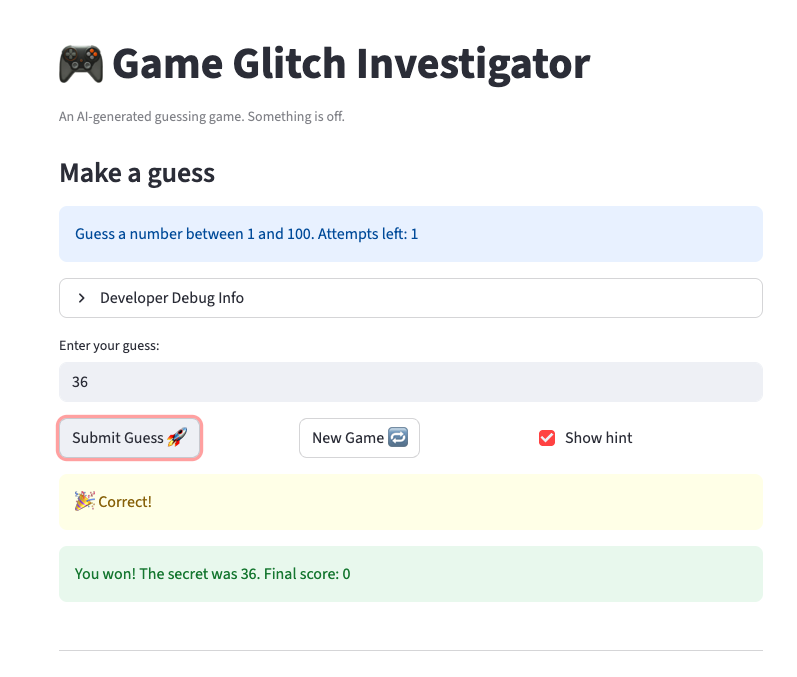

# 🎮 Game Glitch Investigator: The Impossible Guesser

## 🚨 The Situation

You asked an AI to build a simple "Number Guessing Game" using Streamlit.
It wrote the code, ran away, and now the game is unplayable.

- You can't win.
- The hints lie to you.
- The secret number seems to have commitment issues.

## 🛠️ Setup

1. Install dependencies: `pip install -r requirements.txt`
2. Run the broken app: `python -m streamlit run app.py`

## 🕵️‍♂️ Your Mission

1. **Play the game.** Open the "Developer Debug Info" tab in the app to see the secret number. Try to win.
2. **Find the State Bug.** Why does the secret number change every time you click "Submit"? Ask ChatGPT: _"How do I keep a variable from resetting in Streamlit when I click a button?"_
3. **Fix the Logic.** The hints ("Higher/Lower") are wrong. Fix them.
4. **Refactor & Test.** - Move the logic into `logic_utils.py`.
   - Run `pytest` in your terminal.
   - Keep fixing until all tests pass!

## 📝 Document Your Experience

- [x] Describe the game's purpose.
      The purpose of the game is to let the player guess a secret number using the hints provided by the system. Based on the player’s guesses, the game gives feedback such as whether the guess is too high or too low. The player continues guessing until the correct number is found. The game also keeps track of the player’s score based on their actions during the game.
- [x] Detail which bugs you found.
      1 I expected the hint to correctly guide the player toward the secret number (for example, showing “Go higher” when the guess is too low). However, the game sometimes showed the opposite instruction, which made the hints confusing and incorrect.

  2 I expected the score to reset to its initial value when starting a new game. Instead, the score remained the same, even after clicking the New Game button.

  3 I expected the New Game button to reset the game and generate a new secret number after winning. Instead, nothing happened when the button was pressed, and the game did not restart.

- [x] Explain what fixes you applied.
      First, I removed the buggy check_guess implementation from app.py, which previously contained reversed hint messages and a fallback that compared values as strings. I updated the program to import and use the correct check_guess function defined in logic_utils.py so that the main application uses the correct logic.

Second, I fixed the issue where the secret value was sometimes converted to a string in app.py during even-numbered turns. This caused the program to perform lexicographic (string) comparisons instead of numeric comparisons, which produced incorrect hints. I ensured that both the secret number and the player’s guess are always treated as integers.

Finally, after connecting app.py to the corrected logic in logic_utils.py, the Streamlit interface now displays the correct hints and the game behaves as expected.

## 📸 Demo

- [x] [Insert a screenshot of your fixed, winning game here]
      

## 🚀 Stretch Features

- [ ] [If you choose to complete Challenge 4, insert a screenshot of your Enhanced Game UI here]
